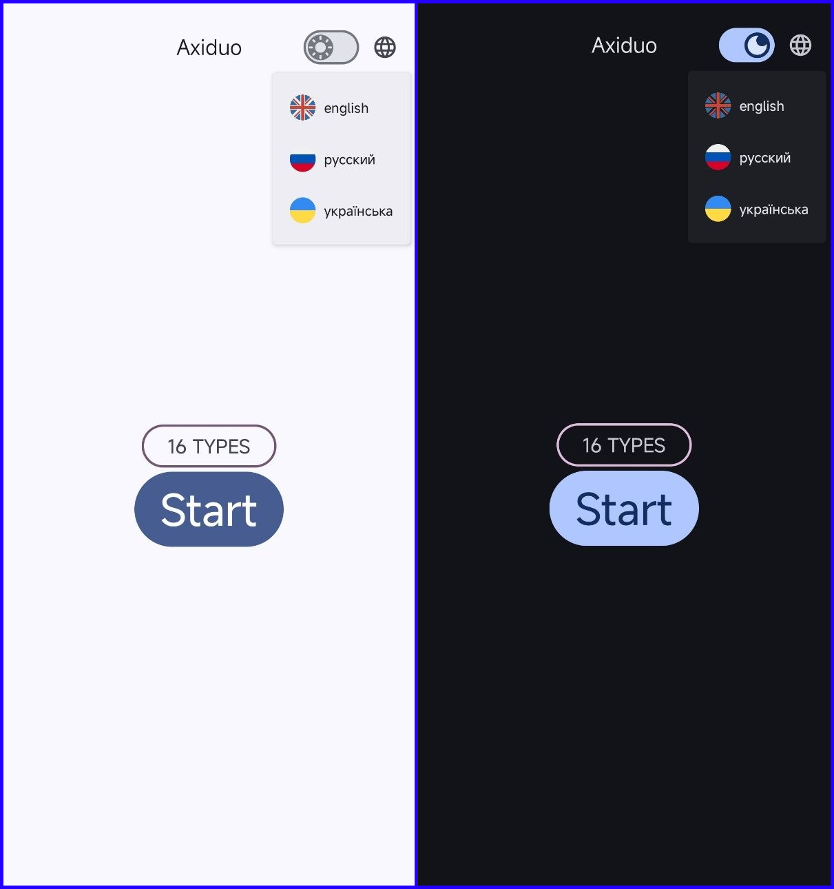
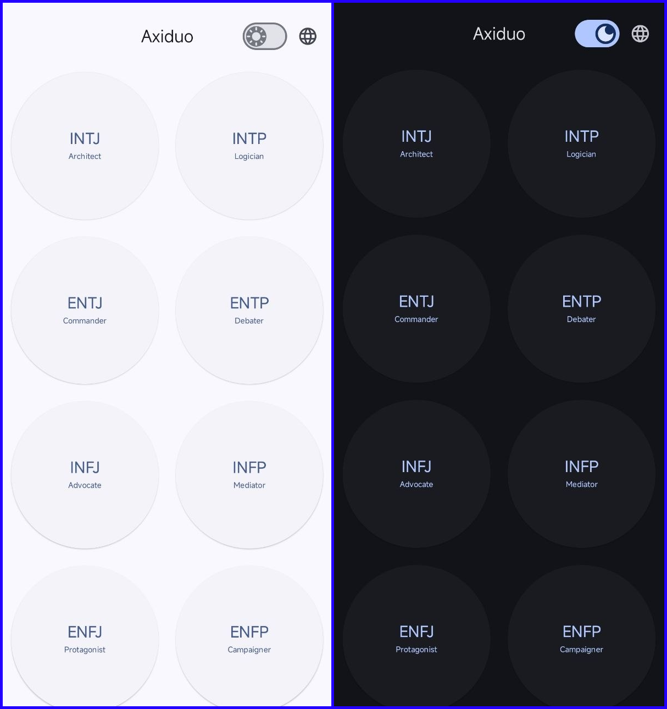
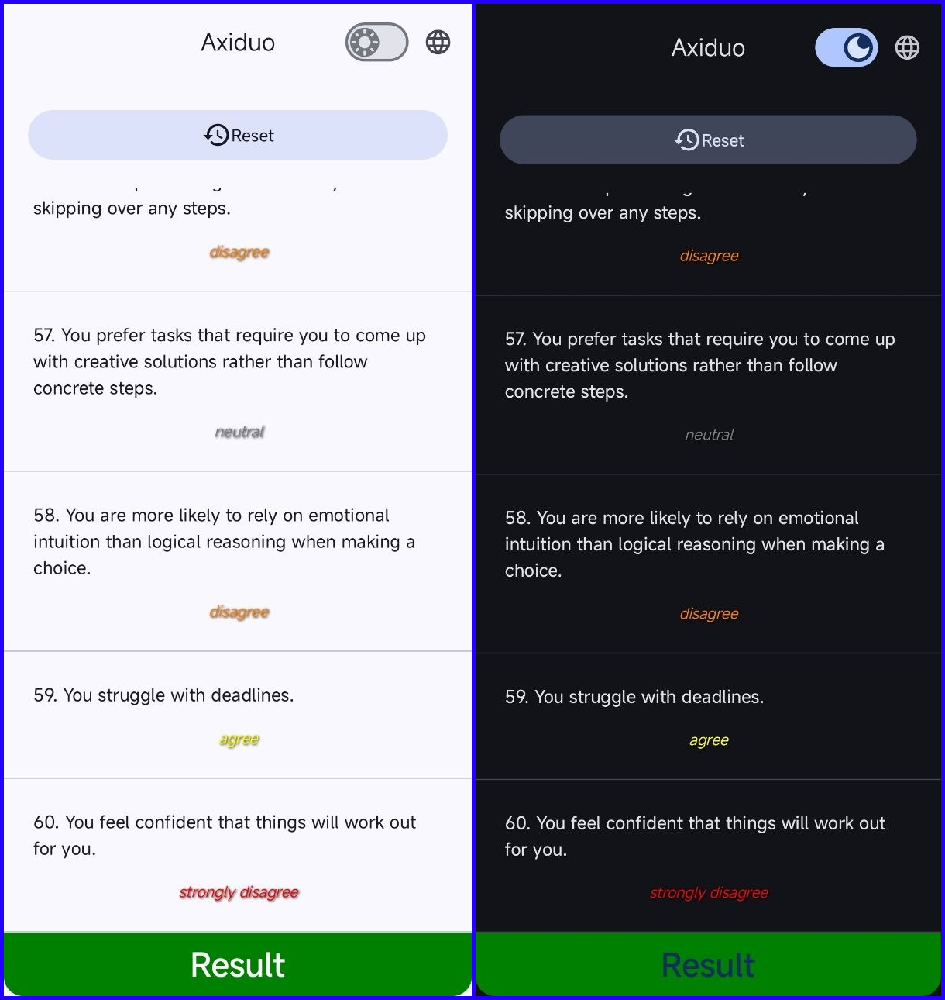
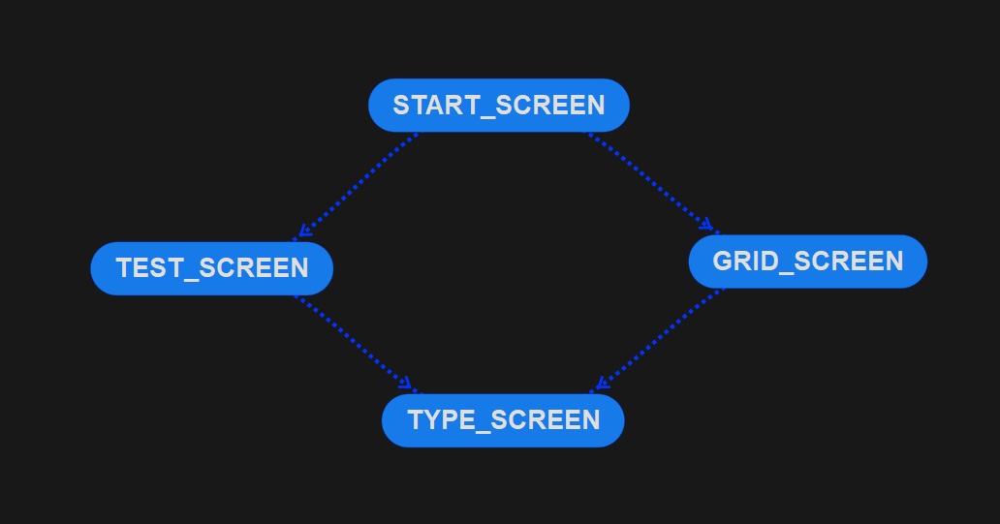
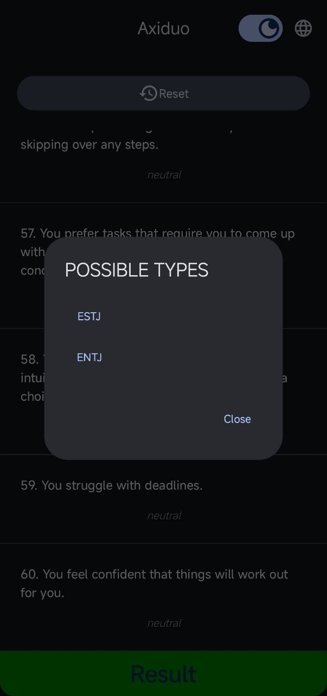

# Axiduo - MBTI Test Application

Axiduo helps determine your personality type according to the MBTI method with support for multilingualism and a dark theme.

---

## 📱 Screenshots
The application supports adaptive design and is correctly displayed in light and dark themes.

<table width="100%">
  <tr> 
    <th align="center" width="50%">START_SCREEN</th> 
    <th align="center" width="50%">GRID_SCREEN</th> 
  </tr>
  <tr>
    <td align="center">  </td>
    <td align="center">  </td>
  </tr>
  <tr>
    <th align="center">TEST_SCREEN</th>
    <th align="center">TYPE_SCREEN</th>
  </tr>
  <tr>
    <td align="center">  </td>
    <td align="center">  </td>
  </tr>
</table>

## 🗺️ Application Navigation
Below is a diagram of transitions between the main screens of the application:

 

## 🧩 Typing
One of the key features of Axiduo is the deep analysis of user responses.
<table border="0">
  <tr>
    <td width="40%" align="center">
      
    </td>
    <td width="60%" valign="top">
      
<b>Important:</b> In the process of passing the test, there is a possibility that the application will determine several possible types for you. This happens when your answers to the questions show close values on different MBTI axes.

      
In this case, the application will offer you a list of the most suitable types for further independent study.

    </td>
  </tr>
</table>
